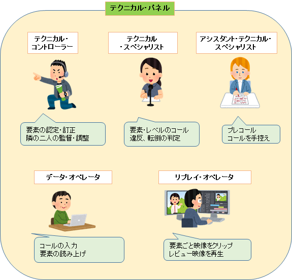

## 構成と役割

- TC: テクニカルコントローラー
- TS: テクニカルスペシャリスト
- ATS: アシスタントテクニカルスペシャリスト
- DO: データオペレーター
- RO: リプレイオペレーター

### TC: テクニカルコントローラー

<Grid container direction="row" alignItems="center">
<Grid item xs="2">

</Grid>

<Grid item xs="8">
<Baloon>ASDASD</Baloon>
</Grid>

</Grid>

監督

### TS: テクニカルスペシャリスト

要素のコール

### ATS: アシスタントテクニカルスペシャリスト

プレコール

### DO: データオペレーター

要素の入力

### RO: リプレイオペレーター

レビュー時のリプレイ操作

## 会話例
###　競技開始前

</img>　「んじゃ、ステップはTSがバラエティとクラスター、ATSがボディ、んでボクがローテーションね」

</img></img>　「はい」

### 開始前

</img>　「最初のエレメンツはジャンプです」

</img>　「はい」

</img>　「了解！」

### 演技開始：コール

</img>　「3Lz、レビューエッジ」

</img>　「次はジャンプです」

</img>　「3F3T、セカンドレビュー」

</img>　「次はステップです」

</img>　「フライングキャメル、、（バタフライ、、）レベル３」

</img>　「次はステップです」

</img>　「ステップシークエンス」

</img>　（ツイズルからロッカー、、、チョクトウ、、、ループ、、、左のロッカーカウンターツイズル、、、、）

</img>　（、、、、あり、、、なし、、、あり、、、あり、、、、）

</img>　（、、、、左、、、左、、右右、、、左、、、）

</img>　「コンプレキシティ、クラスター左のみ」

</img>　「ボディなし」

</img>　「ローテーションあり」

</img>　「レベル３」

</img>　「次はスピンです」

</img>　「スピン・コンボ、、、、、足変え、、、、レベル３」

。。。

### 演技終了：レビュー

</img>　「エレメンツ１２個、レビューは３つです。エレメンツ１番、トリプルルッツ」

</img>　「」

### ダメなレビュー例（あくまでフィクションです）

</img>　「エレメンツ３番のトリプルループですが、これは回転足りてますよね」

</img>　「いや、これは足りてません。アンダーです」

</img>　「は？これは十分足りてるでしょ。回りきってる」

</img>　「どこ見てるんですか。全然足りてない。ちょっとスロー頂戴」

</img>　「、、え、、、ちょっと待って、、、」

</img>　「何やってんの早く」

</img>　「あ、、、ハイ、、、（ポチっとな）」

</img>　「ほら足りてる」

</img>　「足りてない」

</img>　「だから足りてるって！足りてないのはアンタの頭でしょっ！」

</img>　「ちょっと何それ！どういうこと！！」

</img>　「、、、あの、、、ユミちゃんアキちゃん、落ち着いて、、、、」

</img></img><strong><big>「「うっさいわね！！！」」</big></strong>

</img>（。。。。早く決めてくんないかな。。。）

