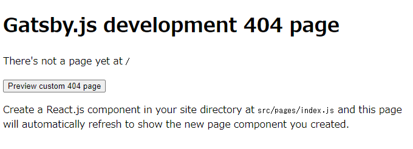

## TL;DR
React, GraphQL, webpack などのフロントエンド、クエリ各種技術を詰め込んだ静的サイトジェネレータらしい。
以前はmiddlemanを使っていたが、gatsbyに乗り換えてみたのでその記録。

スターターなどは使わず、スクラッチから始めて、少しずつ肉付けしていく。

## 前提知識

javascriptはjquery 全盛時代脳のままなので、ES6程度までにはアップデートしないといけない模様。

- export, module, default, named あたりの意味と役割
- 配列：map, forEach の使い方
- アロー関数、引数の扱い
- `` によるリテラルテンプレート

```js
// map, forEach
nodes.map(node => {}>)
nodes.forEach(nodes => {})

const set = [...new Set(nodes)] // uniq
const compact = ndoes.filter(v=>v) // compact

// 大体同じ
const foo = function(a){ }  
const foo = (a) => { }

const foo = a => {} // 引数が一つのときは括弧省略可能
const foo = ( { data, pageContext } ) => {} // TODO
```
## インストール
nodejsベースなので適宜入れる。

```sh
sudo apt install -y nodejs npm
sudo npm install n -g
npm install --global gatsby-cli
```

### 最小限のパッケージを入れる
gatsby 自身とその前提となる react を入れる(react dom も）：

```sh
cd sampleapp
npm i --save react react-dom gatsby
gatsby develop
```

でサーバーが立ち上がり、 localhost:8000 にアクセスできる。
何もないので当然404が出るが、とりあえず立ち上がりはした。



## sourth filetype

src/pages/ 以下は自動的に読んで、よしなに出力してくれる。

- src/pages/index.js -> /
- src/pages/helloworld.js -> /helloworld/
- src/pages/about/index.js -> /about/

などのように。どのように出力するかだが、JSX を返す関数を default で export してあげると、
その通りに出力してくれる：

```sh
mkdir -p src/pages
```

```js:title=src/pages/about.js
import React from "react"

const AboutPage = () => {
    return (<div>I AM A PEN.</div>)
}

export default AboutPage
```

　　export default であれば書き方は、

```js
import React from "react"

export default function () { return (<div>I AM A PEN.</div>)}
```

でも構わない。

## コンポーネント

src/components/*.js でコンポーネント（部品っぽいの）を定義できる。
自作タグみたいなもの。

```js:title=src/components/hello.js
import React from "react"

const Hello = ( ) => {
    return (
        <big>HELLO GUYS!!!</big>
    )
}

export default Hello
```

これをimport してあげると、大きな声で挨拶してくれる Hello タグを使うことができる：

```js:title=src/pages/about.js
...
import "../components/hello.js"

const AboutPage = () => {
    return (<div><Hello/></div>)
}
...
```

## まとめ

- インストールできた
- src/pages/ から　localhost:8000/ に出力できた
- コンポーネント（独自タグ）を作って使えた


<LinkPost to="/software/gatsby/02-graphql/"/>

## 連載記事
<Series title="スクラッチから始めるGatsby" display="card" current="1"/>
