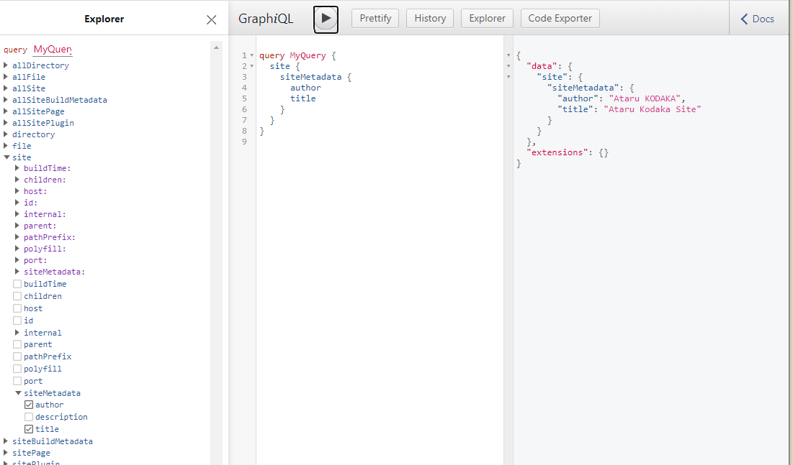

## やること
- GraphQL Interface を触ってみる
- page query / non-page query で情報を取り出す


## サイト情報を登録

gatsby-config.js は重要な設定ファイルで、サイト情報や利用するプラグインなどを登録します。
まずはサイトのタイトルや著者名などを記入：

```js:title=gatsby-config.js
module.exports = {
  siteMetadata: {
    title: "Ataru Kodaka Site",
    author: "Ataru KODAKA",
    description: ''
  }
}  
```

この情報をプログラムからどうやって取り出すのかを見ていきます。

## GraphQLを使ってみる
これちょうだい、ってツリー構造でお願いすると、同じツリーの形で返ってきてくれます。RESTだと１リクエストで１データしか取れませんでしたが、GraphQLだといろいろ一度に取れます。実際触ったほうが早いです。

<a href="http://localhost:8000/___graphql">http://localhost:8000/___graphql</a> にアクセスすると、なにやらツリーやら表示されてる複数ペインが出てきます。試しにexplorer からsite - siteMetadata - title,authorと順にチェックすると、真ん中のペインに

```graphql:title=graphql-query
query MyQuery {
  site {
    siteMetadata {
      title
      author
    }
  }
}
```
と表示されます。再生ボタン(？)を押すと、右のペインに

```graphql:title=graphql-query
{
  "data": {
    "site": {
      "siteMetadata": {
        "title": "Ataru Kodaka Site",
        "author": "Ataru KODAKA"
      }
    }
  },
  "extensions": {}
}
```
と返ってきます。これをプログラム中で取得できれば data.site.siteMetadata.title として参照できるわけです。



## クエリー処理
そのやり方として、大きくわけてPage Query と Non-Page Query の２つがあります。

### Page Query
ページを処理するときに（だけ）使えます。コンポーネント内ではダメです。

```js:title=src/pages/about.js
import React from "react"
 import { graphql } from 'gatsby'

// page query を投げる
export const query = graphql`
  query {
    site {
      siteMetadata {
        title
        author
      }
    }
  }
`
const AboutPage = ({ data }) => {  // data に返ってくる
    return (<ul>
        <li key="title">{data.site.siteMetadata.title}</li>
        <li key="author">{data.site.siteMetadata.author}</li>
    </ul>)
}
export default AboutPage
```

graphql() 関数を使うので import します。
それを使ってクエリを投げて、返ってきたのをconst値に入れてexportしておくと、
別に作った関数で結果が引数として受け取れます。よく分からんがすごい。

結果が JSONで入ってるので好きなように使います。

### Non-Page Query
今度はページ処理ではなく、コンポーネント内から読んでみます。
前述の方法は使えなず、その代わりに useStaticQuery()というのを使います。

```js:title=src/components/hello.js
import React from "react"
import { graphql, useStaticQuery } from "gatsby"

const Hello = ( ) => {
    const data = useStaticQuery(graphql`
    {
        site {
            siteMetadata {
                author
            }
        }
    }        
    `)
    return (
        <big>HELLO {data.site.siteMetadata.author}!!!</big>
    )
}

export default Hello
```

これで著者に向かって挨拶してくれるタグができました。

次はマークダウンを使います。

<LinkPost to="/software/gatsby/03-markdown/">NEXT: 第3回：Markdown</LinkPost>
