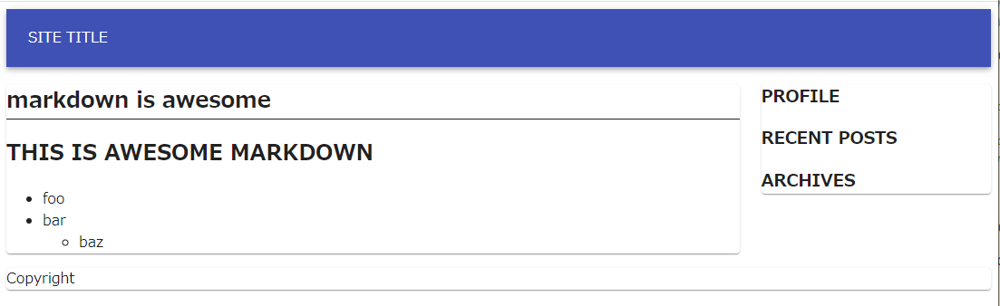

## やること

- レイアウトや身だしなみを整えます
- レスポンシブルデザインは material-ui で
- css 

よくある、上部にタイトルなどのヘッダ、真ん中の左に本文、右にサイドバー、そして下部にフッターという構成できいます。

## material-ui のインストール
コンポーネント集の material-ui を入れておきます。各種部品やグリッドシステムが入ってるので使います。

```sh
npm i --save gatsby-plugin-material-ui @material-ui/core 
```

いつもどおり `gatsby-plugin-material-ui` を plugin に入れときます。

## 大まかなレイアウト
ざっくりと組みます。

```js:title=src/components/layout.js
import React from "react"
import Paper from '@material-ui/core/Paper'

const Header = () => (
    <header>
        <Paper>SITE TITLE</Paper>
    </header>
)
const Footer = () => (
    <footer>
        <Paper>Copyright</Paper>
    </footer>
)
const Layout = ({ children }) => (
    <div>
        <Header/>

        <Paper>{children}</Paper>

        <Footer/>        
    </div>
)
export default Layout
```

とりあえず上中下と分けました。テンプレートで今作った Layoutタグを使います。

```js:title=src/templates/post-template.js
    import Layout from "../components/layout.js"
    ...
    return (
        <Layout>
            <h2>{node.frontmatter.title}</h2>
            <MDXRenderer>
                {node.body}
            </MDXRenderer>
        </Layout>
    )
    ...
```

### Appbar
よくある appbar をヘッダに配置してみます。

```js:title=src/components/layout.js
import AppBar from '@material-ui/core/AppBar'
import Toolbar from '@material-ui/core/Toolbar'
...
const Header = () => (
    <header>
        <AppBar position="static">
            <Toolbar>
                SITE TITLE
            </Toolbar>    
        </AppBar>
    </header>    
)
```
### 中段をメインとサイドバーに分割

grid を使って 9:3 に分けます。モバイル端末(xs)の場合は上下に配置します。

```js:title=src/components/layout.js
import Grid from '@material-ui/core/Grid'
...
const Layout = ({ children }) => (
    <div>
        <Header/>

        <Grid container spacing={3}>
            <Grid item sm={9} xs={12}>
                <Paper>{children}</Paper>
            </Grid>

            <Grid item sm={3} xs={12}>
                <Sidebar/>
            </Grid>
        </Grid>
        
        <Footer/>
    </div>
```

サイドバーにはプロフィール情報やアーカイブなどを配置する予定に。

```js:title=src/components/sidebar.js
const Sidebar = () => (
    <Paper>
        <h3>PROFILE</h3>
        <h3>RECENT POSTS</h3>
        <h3>ARCHIVES</h3>
    </Paper>
)
```

## CSSを使う
いくつかやり方があります。

### Global CSS
```css:title=src/styles/global.css
body {
  background-color: red;
}
nav.breadcrumb {
    font-size: small;
    border-top: 1px solid #ddd;
    ...
```

などと汎用の css を定義して、gatsby-brower.js で読み込みます：

```js:title=gatsby-brower.js
import './src/styles/global.css'
...
```

これでどのページでも読み込まれます。

各所でモジュール化したい場合は CSS Modules か CSS-in-JS を使います。

### CSS modules
対応する module.css ファイルを作りそこに css を定義して読み込む形：

```css:title=src/components/post.module.css
.title {
    font-weight: bold;
}
```
と .module.css という名前で保存して、

```js:title=src/templates/post-template.css
import postStyles '../components/post.module.css'

    return (
        <Layout>
            <h2 className={postStyles.title}>{node.frontmatter.title}</h2>
...            
```

とimportすると、attribute でcssクラスとして参照できます。


### CSS in JS
fontWeight とかなっちゃうオブジェクト型のはあまり好きではないので、通常の css記法が取れる emotion を使います。

```sh
npm install --save gatsby-plugin-emotion @emotion/react @emotion/styled
```

```js:title=gatsby-config.js
module.exports = {
  plugins: [
    ...
    `gatsby-plugin-emotion`,
```

styled でやるときは、

```js
import styled from '@emotion/styled'

const Title=styled.div`
    font-size: 2rem;
`    
```

css crop は

```js
import { css } from '@emotion/react'
const big = css`
    font-size: 2rem;
`

const Foo = () => (
    <span css={big}>big</span>
    ...
```

手軽でよいね。局所的に使うときはcrop、いろいろちゃんとするときはmodule って感じで使い分けてる。

## やったこと
こんな感じに：




## 連載記事
<Series title="スクラッチから始めるGatsby" display="card" current="4"/>
