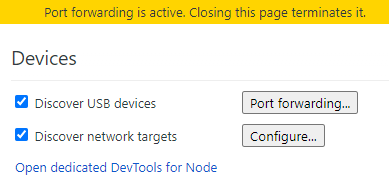
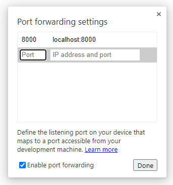

## やりかた
下手に wifi経由でやろうとするとファイアウォールの設定やらいろいろ面倒なので、素直にusbで繋ぐ。android。

まずデバッグを有効にするアレをしとく。
んで繋いだら chrome://inspect/#devicesにアクセスし、

"Porf fowarding" で port: 8000, IPaddress and port: localhost:8000 と設定し、Enable port forwarding のチェックを入れる。

実機から localhost:8000 にアクセスすれば見られるはず。

## 参考サイト
<LinkExternal to="https://blog.mktia.com/how-to-debug-websites-on-android-with-chrome-devtools/">Chrome DevToolsを用いて実機のAndroidスマホでデバッグする</LinkExternal>

